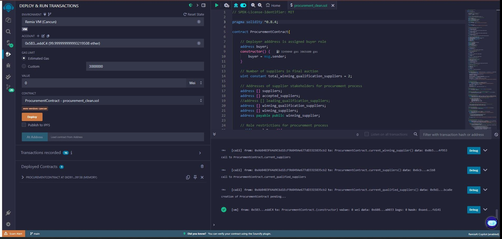
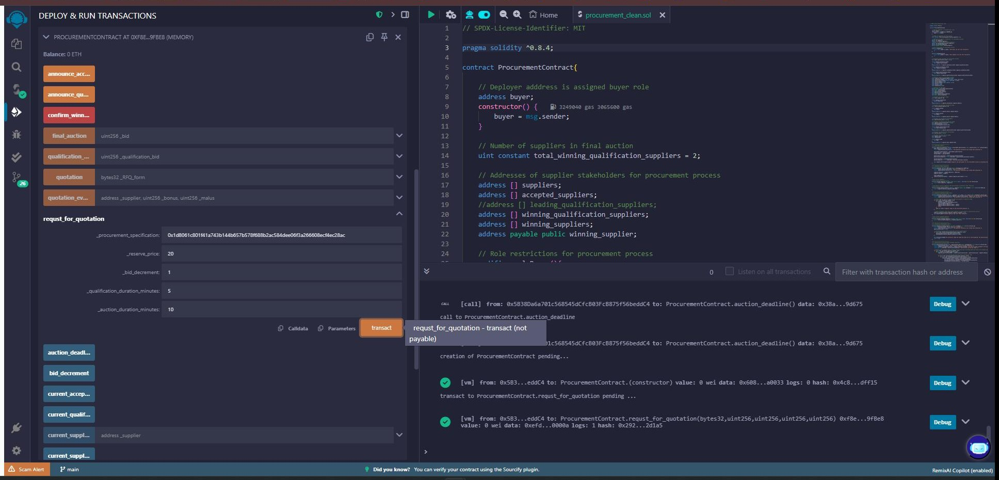
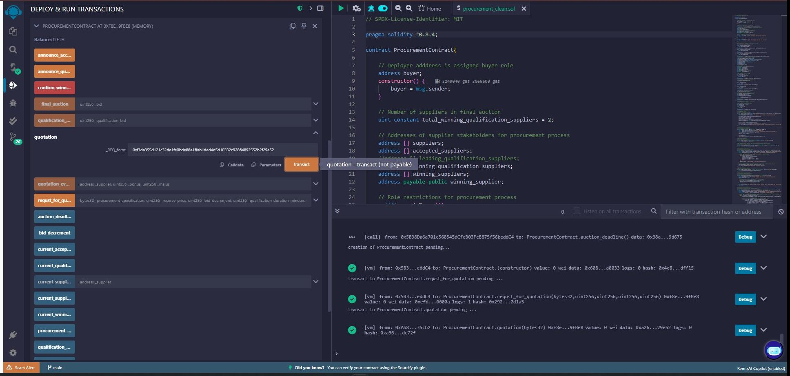
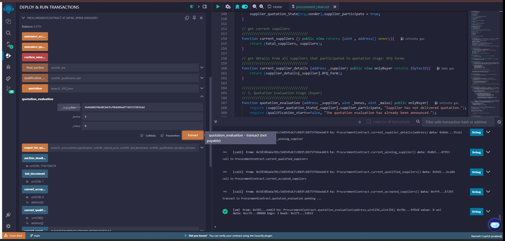
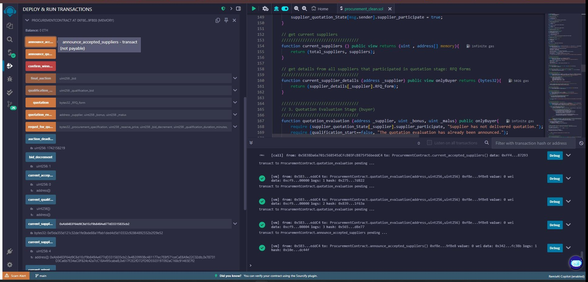
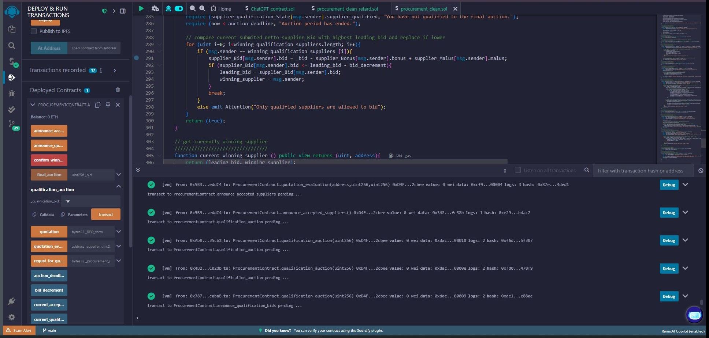
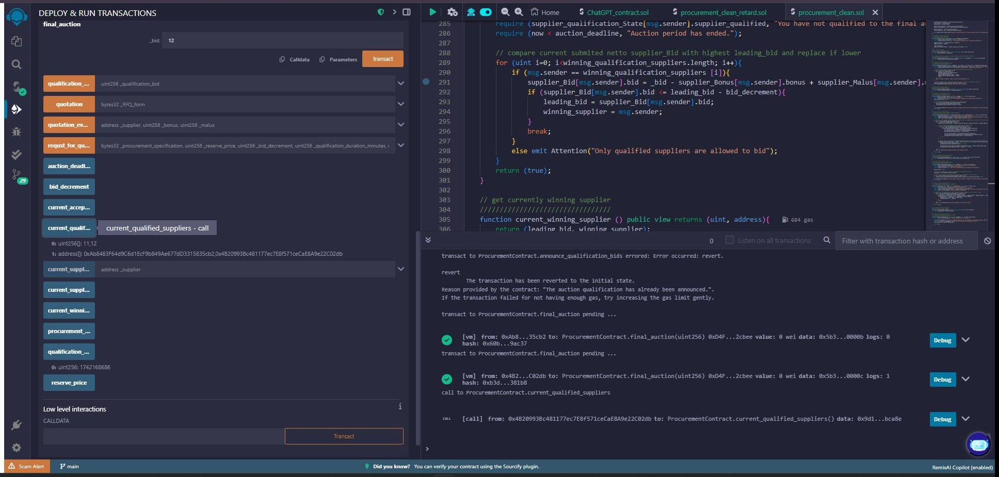
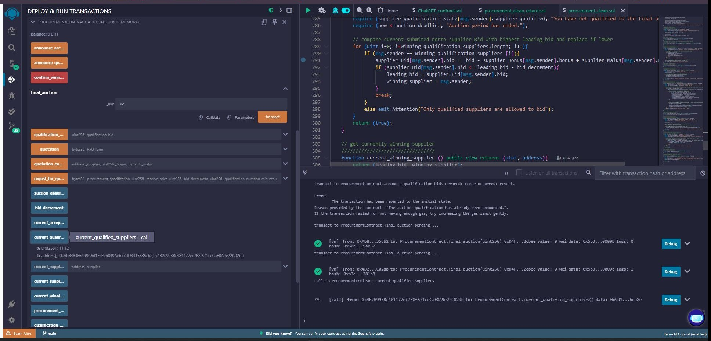
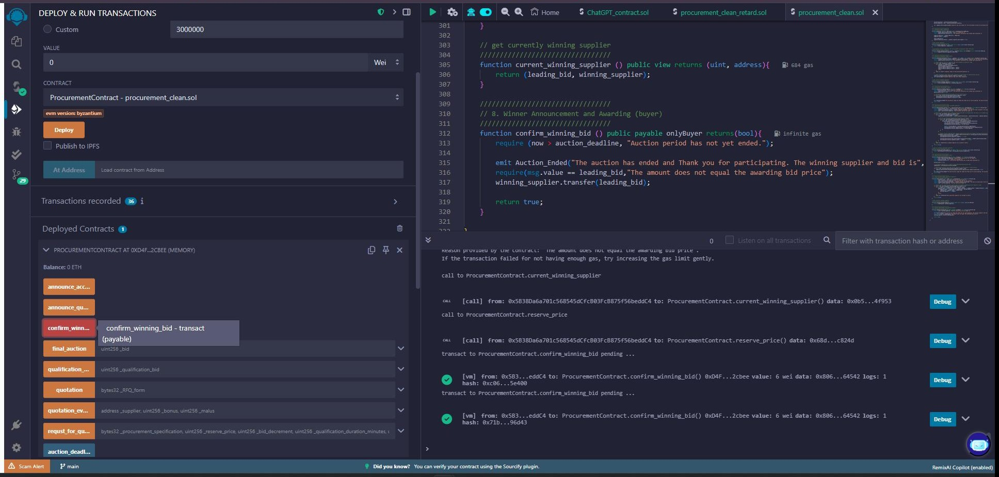

# Procurement Auction (archived)

> Archived snapshot of a Solidity prototype. No longer maintained.

**Credible commitment for procurement auctions, implemented on the blockchain.**

▶️ **[Try the contract yourself in Remix](https://remix.ethereum.org/?#url=https://github.com/Per-Paulsen/procurement-auction-archive/blob/main/contracts/procurement_clean_v2.sol)**. Opens `procurement_clean_v2.sol` (Solidity ^0.8.4) directly in the browser-based Remix IDE. No wallet, no setup: compile, deploy on Remix VM, and click through the auction lifecycle yourself.

## The pitch in one paragraph

In B2B procurement, even an optimized multi-stage auction can fail
in practice, not because
the mechanism is bad, but because suppliers can't fully trust that the
outcome is final. They expect renegotiation. They hedge their bids
accordingly. The auction degrades into yet another round of negotiation.
Smart contracts solve exactly this layer of the problem: an
auction-as-code, deployed on a public blockchain, can credibly commit to
its own outcome. The buyer cannot deviate, even if they wanted to. This
repository implements a four-stage reverse procurement auction
(pre-auction → quotation → qualification → final auction) on Solidity,
with a bonus/malus mechanism for supplier differentiation.

## Origin: a Tier-1 automotive supplier story

While supporting auction-design consulting at a Tier-1 automotive
supplier, my mentor told me about an Italian supplier who had been
eliminated in the qualification round. The supplier called my mentor
and asked: *"How do we proceed from here?"* My mentor: *"You don't,
you've been eliminated."* The supplier: *"Yes, I understand, but how
do we proceed? I can of course bid lower."*

That conversation crystallized the commitment problem in procurement.
Even when the buyer is committed to a transparent, competitive process
in principle, suppliers expect renegotiation. They cannot be sure the
buyer won't be swayed by a post-auction call. So they shade their bids,
which pulls the entire auction outcome away from efficiency.

The relevant theoretical lens is **mechanism design with limited
commitment**: a body of work that takes the mechanism designer's
inability to credibly commit to announced outcomes as the central
friction (McAfee & Vincent 1997 on sequentially optimal auctions;
Bester & Strausz 2001 on the revelation principle without commitment;
Skreta 2006 on sequentially optimal mechanisms). What this literature
treats as a structural constraint, smart contracts treat as a tooling
problem: by encoding the auction in immutable code, the buyer commits
not by intention but by structural impossibility of deviation. **The
auction itself becomes the commitment device.**

## How it works: the four-stage reverse auction

The contract codifies a multi-stage procurement schema, extended
with a bonus/malus system for supplier differentiation.

**1. Buyer deploys the contract and issues a request for quotation.**

The buyer (the deployer) calls `request_for_quotation(...)` with the
procurement specification (committed via SHA-256 hash for
confidentiality), reserve price, bid decrement, and durations for
qualification and final auction.

**2. Suppliers submit quotations.**

Each supplier calls `quotation(...)` with their RFI or RFP form
committed as a `bytes32` hash. Confidentiality is preserved on-chain;
the buyer reveals the off-chain content of accepted RFQs separately.

**3. Buyer evaluates quotations and assigns bonus/malus per supplier.**

For each participating supplier, the buyer calls
`quotation_evaluation(supplier, bonus, malus)`. This is the
procurement-specific extension: a supplier with a strong track record
gets a bid bonus (their effective bid is reduced), while a supplier
with quality concerns gets a malus (their effective bid is increased).

**4. Qualification auction: first-round bidding with bonus/malus
adjustment.**

Accepted suppliers bid. Each submitted bid is adjusted by the
supplier's bonus/malus before comparison. The lowest adjusted bidders
qualify for the final round.

**5. Final auction: top suppliers compete again.**

The qualified suppliers (top 2 by default, configurable via
`total_winning_qualification_suppliers`) submit final bids. The lowest
adjusted bid wins.

**6. Winner confirms and pays via the contract's payable function.**

The winning supplier confirms their bid value through the smart
contract's `confirm_winning_bid` payable function, locking the contract
state.

## What's in this repo

| Folder            | What it shows                                                                          |
| ---               | ---                                                                                    |
| `contracts/`      | Six Solidity files. Five iterations from sketch to clean (Solidity `^0.4.25`): `sc.sol` → `simpleAuctionContract.sol` → `fullAuctionContract.sol` → `procurementContract.sol` → `procurement_clean.sol`. Plus `procurement_clean_v2.sol`, a later polish pass on Solidity `^0.8.4` (the version visible in the screenshots; this is the recommended file to open in Remix). Plus `abi.json` (compiled output) and `package.json` (deps). |
| `screenshots/`    | Fourteen Remix IDE screenshots from the polish pass, walking through the contract lifecycle from deployment to winning-bid confirmation. |

## Tech stack

- **Smart contract language**: Solidity (early iterations on `^0.4.25`;
  later polish pass on `^0.8.4`, see `contracts/procurement_clean_v2.sol`)
- **IDE**: Remix Ethereum (browser-based)
- **Test network**: Rinkeby, deprecated by Ethereum Foundation in
  October 2022. The polish pass ran on Remix VM (Cancun fork) only.
- **Wallet**: Metamask (Rinkeby connection during early development)

## Status

- Five contract iterations from sketch to clean (Solidity `^0.4.25`)
- Later polish pass on `^0.8.4` (modern compiler, screenshot pass)
- Rinkeby deployment: dead since the testnet was deprecated
- Frozen snapshot, not under active development

## Why archived

The mechanism design pattern is sound. The adoption challenge is the
harder one. Conservative procurement organizations (Tier-1 automotive
suppliers, large industrial buyers) are unlikely to move sourcing onto
a public blockchain in the near term, regardless of how cleanly the
commitment problem can be solved on it. And smart contracts only solve
the auction layer: the off-chain delivery performance risk (does the
supplier actually deliver as bid?) remains entirely orthogonal and
needs separate trust infrastructure.

The speculative-crypto cycle that surrounded blockchain has cooled. The use case represented here, smart contracts as
immutable-mechanism implementation in B2B coordination problems, is
quieter, narrower, and arguably more interesting than the trading
hype, but it has not yet found its commercial pathway.

This project is preserved as a snapshot of the bridge between mechanism
design theory and concrete on-chain implementation. The current focus
is on AI Product Engineering at Expliq AI, where the problem
formulations are different but the underlying discipline (mechanism
design + tooling that earns trust) is the same.

## Acknowledgements

The base reverse-auction contract structure was adapted from a public
Solidity tutorial repository
([Solidity-Contracts/Reverse-Auction](https://github.com/Solidity-Contracts/Reverse-Auction)).
The procurement-specific multi-stage architecture (RFI/RFP hash
commits, bonus/malus per supplier, qualification → final auction
filtering, winner-payable confirmation) is an original multi-stage
awarding design, extended for combinatorial bidding logic in early
drafts.

The theoretical framing draws on the mechanism-design-with-limited-
commitment literature (McAfee & Vincent 1997; Bester & Strausz 2001;
Skreta 2006) and the broader implementation theory tradition (Maskin
1977/1999; Moore & Repullo 1988). Bolton & Dewatripont's *Contract
Theory* (2005, MIT Press) provides the textbook synthesis.

---

*Restored in 2026 from a local archive.*
